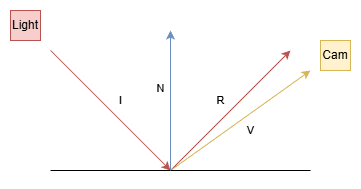

# Lighting

## Specular lighting



There are six variables used here:

- 'I' is the light source to surface direction
- 'L' is the surface to light source direction (literally -I)
- 'N' is the vertex normal
- 'R' is the reflection of the light ray from the surface. It is symmetrical across the normal from 'I' and its direction is reversed.
- 'V' is the surface to camera angle
- 'α' is the angle between 'R' and 'V'

### Calculations

I is the light to surface angle, L is the surface to light angle. We need both because diffuse uses L, and specual uses I. So we just calculate one and negate it to get the other.

```
vec3 L = normalize(lightPosition - vertexPos); // We use normalize because we want the direction but not the magnititude
vec3 I = -L;
```

R is the reflected ray

```
vec3 R = reflect(I, vertexNormal); // Use I or -L
```

'V' is the surface to camera angle

```
vec3 V = normalize(cameraPos - vertexPos);
```

α is the angle between R and V

```
float alpha = dot(R, V);
alpha = max(alpha, 0.0); // Clamp to avoid negative values
```

### More variables

Then... there are more variables! These represent properties of the material.

Specular intensity controls how bright the highlight is, specular power controls how focused/sharp the highlight is. Think of it like a flashlight: intensity is how bright the bulb is, power is how narrow the beam is.

M is the specular intensity of the material. 0-1. Wood would be be 0-0.3, silver would be 0.9-1, etc.
P is the 'specular power' or the 'shininess factor'. Not sure how this differs from specular intensity.

- 1-10 = very broad, dull highlights (rough surfaces like clay or rubber)
- 16-64 = moderate shininess (plastic, polished wood)
- 64-128 = sharp highlights (polished metal, wet surfaces)
- 128-256 = extremely sharp, tight highlights (mirrors, chrome)

### Final equation

```
specular = lightColour * surfaceColour * M * A^P
vec3 result = (ambient + diffuse + specular);
finalColour = texture(textureData, fragTexCoords) * vec4(fragColour * result, 1.0);
```
