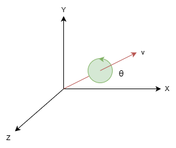

# Quaternions



A rotation by θ about the axis given by a unit vector v = (v1, v2, v3) corresponds to the quaternion

q = (sin(θ/2)v1, sin(θ/2)v2, sin(θ/2)v3, cos(θ/2)).

```
private Quaternionf createQuaternion(float theta, boolean xAxis, boolean yAxis, boolean zAxis) {
  float x = xAxis ? (float) Math.sin(theta / 2) : 0;
  float y = yAxis ? (float) Math.sin(theta / 2) : 0;
  float z = zAxis ? (float) Math.sin(theta / 2) : 0;
  float w = (float) Math.cos(theta / 2);
  return new Quaternionf(x, y, z, w);
}
```

Note that you need to multiply the current rotation quaternion by the above result to get the new rotation.

```
Quaternionf q1 = graphics.get("rotation")
Quaternionf q2 = createQuaternion(0.02f, true, false, false);
Quaternionf q3 = q1.mul(q2);
g.set("rotation", q3);
```
